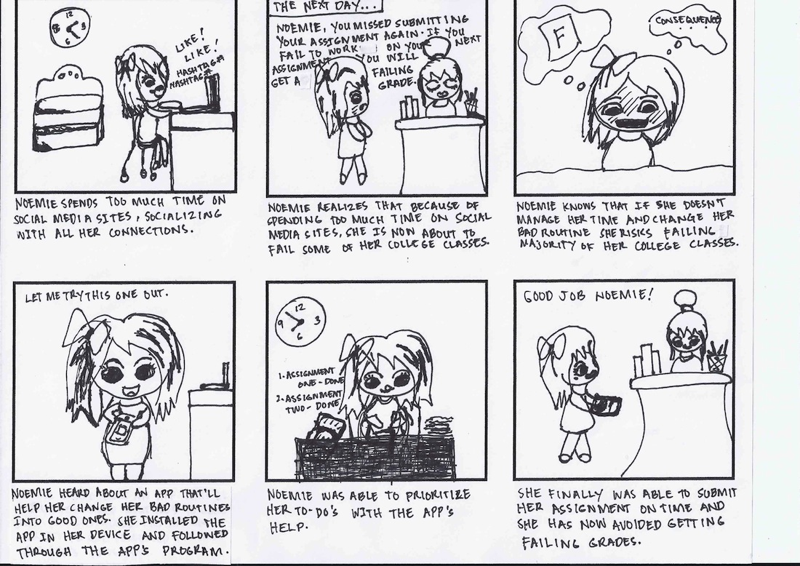
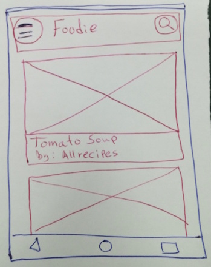
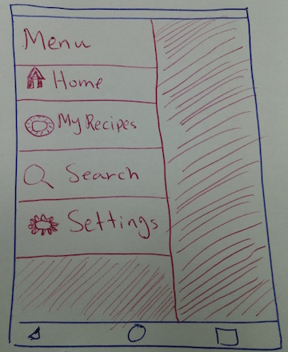
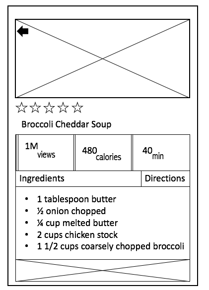

## UI Prototyping

## UI prototypes

> They're like architectural models that architects create to communicate their ideas, test them, and show the client what the building look like without hiring construction crews.

## Prototyping Techniques
- Storyboarding
- Low-Fidelity Prototyping
  - Paper Prototypes
- Mid-Fidelity Prototyping
  - Wireframes
- High-Fidelity Prototyping
  - Interactive mockups
- Code it, add database, and launch it

## How to start?
- Start with an idea
- Develop your personas and scenarios
- Develop your storyboards
- Discuss them with your client
- Rapidly create and test your low-fidelity prototypes
- Create and test your mid-fidelity prototypes (wireframes)
- Create and test your high-fidelity prototypes
- Write code!

## Storyboarding
- It's about communicating your goal and the story of your product
- You want to include the motivation, entire task, and success outcome
- It is not about a pretty picture but about communicating your ideas

## Storyboarding Example

## A storyboard helps us answer the following questions:
- Is this the right idea?
- Does it solve the problem?
- Does it meet a user's need?

## Low-Fidelity Prototyping

> Low-fidelity prototypes are rough and hand-sketched drawings of your design concepts to validate them.

## Low-Fidelity Prototyping
- Validate ideas at the early stage of design
- Inexpensive to do and modify
- Users are more likely to criticize

## Paper prototypes are the most widely used type of prototypes

## Paper Prototypes

## Tips for creating better paper prototypes
- Create quick paper prototypes
- Make use of user interface components
- For more difficult UI controls or animations, draw them or describe them
  - Examples: progress bar, animation, background, transitions
- Make use of digital tools to add more interactive experience to your paper prototypes
  - Examples: Google Photos, Marvel mobile app

## Demo

## Mid-Fidelity Prototyping
- It's a form of prototyping performed at the pixel-level using a tool.
- It's often known as wireframes or screen blueprints
- The focus is on the page layout or arrangement of UI elements and content
- They do not often include aesthetic or style details
- They are created using tools such as PowerPoint, Google Slides, Balsamiq

## Wireframe Example

## Digital Mockups